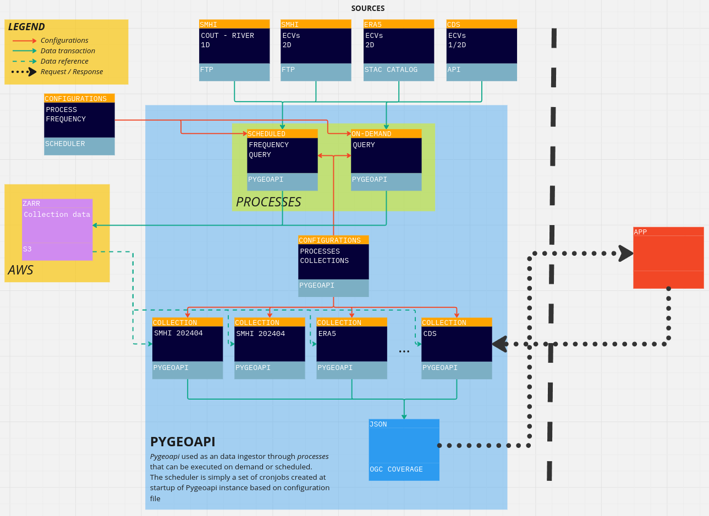

# pygeoapi_ingestor_plugin

A plugin to enable Pygeoapi data ingestion with scheduled processes.
The diagram below shows the implemented workflow:



Source: <https://miro.com/app/board/uXjVKIAEdbo=/>

## Climate Data Ingestor

The Climate Data Ingestor is a crucial component of the DIRECTED project’s cloud-based Climate Service (CS) platform.
Its primary function is to handle the ingestion of various types of climate data from multiple sources, ensuring that the data is accurately fetched, processed, and stored for further analysis and visualisation.

The Climate Data Ingestor infrastructure is based on Pygeoapi, making the component consistent and OGC compliant.
For each data source an ingestor process is defined as a Pygeoapi process, the processes can be executed through a REST API call or by editing a scheduler configuration file, containing specific information of the ingestor process (dataset, query, frequency, ...).
The scheduler configuration is parsed at startup and can trigger the processes in two different ways based on *frequency* field:

- **on-demand**: the process is executed at startup
- **scheduled**: the process is scheduled as a cronjob (following cronjob syntax for frequency field in the scheduler configuration file)

After the process completes the execution a ZARR file storage is created in a specific cloud bucket and Pygeoapi configuration file is updated with a new Collection of type xarray-edr addressing the ZARR file path.
To enhance performances the ZARR file storage can be saved inside the Pygeoapi instance as long as a volume is configured in order to have data persistence.
Once the new Collection is generated the data can be queried through OGC API directly.
The ingestor processes can be used for the following data sources:

- FTP
- CDS
- STAC Catalog

Below is a detailed description of the components and functionalities of the Climate Ingestor Docker.

## Getting started

To start the docker container of Pygeoapi service simply edit `docker-compose.yml` file to include the required environment variables and build plugin package, then start it.

```shell
docker compose build
docker compose up
```

After Pygeoapi is ready if a `scheduler.yaml` file is provided, requests are executed or scheduled via crontab based on frequency field in scheduler configuration.

## Ingestor process

Pygeoapi processes are related to data sources for the ingestor.
The data sources available to the ingestor are defined inside `plugins/src/plugins` folder.

### Available processes

#### SMHI FTP process

The SMHI process retrieve data from SMHI FTP server, the FTP credentials are located in `docker-compose.yml` file and stored as environment variables.
The following variables are required:

- `FTP_HOST`
- `FTP_DIR`
- `FTP_USER`
- `FTP_PASS`
- `DEFAULT_BUCKET`
- `DEFAULT_REMOTE_DIR`

In `invoke_smhi_ingestor.py` file the process is invoked with data from `scheduler.yaml` file.

#### CDS API process

The CDS process retrieve data from CDS, the API credentials are located in `docker-compose.yml` file and stored as environment variables.
The following variables are required:

- `CDSAPI_KEY`: checkout the Climate Data Store (CDS) Application Program Interface (API) documentation [for retrieving an API key](https://cds.climate.copernicus.eu/api-how-to).
  The `CDSAPI_KEY` is created by concatenating your `UID + ':' API Key`, e.g. `123456:12345678-9101-1121-1314-151617181920`
- `DEFAULT_BUCKET`
- `DEFAULT_REMOTE_DIR`

In `invoke_cds_ingestor.py` file the process is invoked with data from `scheduler.yaml` file.

### Creating a new process

To create a new process to ingest a new data source follow these steps:

#### Ingestor process file

Create a new Python file inside `plugins/src/plugins` folder, for example `ingestor_NEW_SOURCE_process.py`.
The new file must contains a class which implements `pygeoapi.process.base.BaseProcessor`

```python
class IngestorExampleProcessProcessor(BaseProcessor):
    """
    Ingestor Processor example
    """

    def __init__(self, processor_def):
        """
        Initialize object

        :param processor_def: provider definition

        :returns: pygeoapi.process.ingestor_process.IngestorExampleProcessProcessor
        """

        super().__init__(processor_def, PROCESS_METADATA)

    def execute(self, data):
        mimetype = 'application/json'

        # DATA RETRIEVING LOGIC AND OUTPUT ZARR FILE CREATION GOES HERE

        # UPDATE PYGEOAPI CONFIG FILE
        with open('/pygeoapi/local.config.yml', 'r') as file:
            config = yaml.safe_load(file)

        config['resources'][dataset] = {
            'type': 'collection',
            'title': dataset,
            'description': 'CDS Discharge data of Georgia',
            'keywords': ['Georgia', 'country'],
            'extents': {
                'spatial': {
                    'bbox': [min_x, min_y, max_x, max_y],
                    'crs': 'http://www.opengis.net/def/crs/OGC/1.3/CRS84'
                },
                'temporal': {
                    'begin': datetime_min,
                    'end': datetime_max
                    }
                },
            'providers': [
                {
                    'type': 'edr',
                    'name': 'xarray-edr',
                    'data': remote_url,
                    'x_field': 'longitude',
                    'y_field': 'latitude',
                    'time_field': 'time',
                    'format': {'name': 'zarr', 'mimetype': 'application/zip'},
                    'options': {
                        's3': {'anon': True, 'requester_pays': False}
                    }
                }
            ]
        }

        with  open('/pygeoapi/local.config.yml', 'w') as outfile:
            yaml.dump(config, outfile, default_flow_style=False)


        outputs = {
            'id': 'ingestor-process',
            'value': zarr_url
        }
        return mimetype, outputs

    def __repr__(self):
        return f'<IngestorExampleProcessProcessor> {self.name}'

```

After the creation of the output zarr file the configuration file must be updated by creating a new collection addressing the zarr data created.
`PROCESS_METADATA` is a dictionary with metadata about the process, it contains a description of the ingestor and data source it gives access to, interfaces for the REST API it exposes, keywords.
Here's an example of this dictionary:

```python
#: Process metadata and description
PROCESS_METADATA = {
    'version': '0.2.0',
    'id': 'ingestor-process',
    'title': {
        'en': 'Ingestor Process',
    },
    'description': {
        'en': 'Ingestor Process from Example data source'},
    'jobControlOptions': ['sync-execute', 'async-execute'],
    'keywords': ['ingestor process'],
    'links': [{
        'type': 'text/html',
        'rel': 'about',
        'title': 'information',
        'href': 'https://example.org/process',
        'hreflang': 'en-US'
    }],
    'inputs': {
        'living_lab': {
            'title': 'Living Lab',
            'description': 'The living lab for which the data is fetched',
            'schema': {
                'type': 'string'
            }
        },
        'query': {
            'title': 'Query',
            'description': 'The query to fetch the data from the CDS API',
            'schema': {
                'type': 'string'
            }
        },
        'zarr_out': {
            'title': 'Zarr Output',
            'description': 'The URL of the Zarr file in the S3 bucket',
            'schema': {
                'type': 'string'
            }
        }
    },
    'outputs': {
        'id': {
            'title': 'ID',
            'description': 'The ID of the process execution',
            'schema': {
                'type': 'string'
            }
        },
        'value': {
            'title': 'Value',
            'description': 'The URL of the Zarr file in the S3 bucket',
            'schema': {
                'type': 'string'
            }
        }
    },
    'example': {
        "inputs": {
            "living_lab": "georgia",
            "query": {
                "area": [10,40,12,42]
            },
            "zarr": "s3://path/to/zarr"
        }
    }
}
```

After the process file is created update `__init__.py` file to export the new class created by adding

```python
from .ingestor_example_process import IngestorExampleProcessProcessor
```

#### Process invocation

To execute the invocation to the previously created ingestor process you can manually run an POST request that matches the interface of the process API.

To run an scheduled request you can create a python file that make a POST request and edit the `scheduler.yaml` file execute that through the scheduler.

Here's an example of a python file called `invoke_example_ingestor.py` that make a REST request to the process we created earlier.

```python
import requests
import json
from datetime import datetime

# ingestor id
ingestor_process = 'ingestor-process'

# parameters for the ingestor
living_lab = "georgia"
zarr_out = f"s3://path/to/zarr/{issue_date}/{living_lab}_{data_dir}.zarr"

# initialize body data
data = {
    "inputs": {
        "living_lab": living_lab,
        "query": {
            "area": [10,40,12,42]
        }
        "zarr_out": zarr_out
    }
}

# curl command to invoke the ingestor using requests
response = requests.post(
    f"http://localhost/processes/{ingestor_process}/execution",
    headers={
        'accept': 'application/json',
        'Content-Type': 'application/json'
    },
    data=json.dumps(data)
)

print(f"Response status code: {response.status_code}")
print(f"Response body: {response.text}")
```

##### Scheduler

To setup the scheduling feature a `scheduler.yaml` file is required.
Here's a demo scheduler file:

```yaml
living_lab:
  name: forli
  bbox:
  - 12
  - 44
  - 13
  - 45
  scheduler:
    smhi:
      frequency: 12 * * * *

    cds:
      frequency: 12 * * * *
      dataset: cems-glofas-forecast
      # date_start: 2024-04-02
      # date_end: 2024-04-03
      query: {
        'system_version': 'operational',
        'hydrological_model': 'lisflood',
        'product_type': 'ensemble_perturbed_forecasts',
        'variable': 'river_discharge_in_the_last_24_hours',
        # 'year': '2024',
        # 'month': '04',
        # 'day': '02',
        'leadtime_hour': [
            '24', '48', '72',
            '96', '120', '144',
            '168', '192', '216',
            '240', '264', '288',
            '312', '336', '360',
            '384', '408', '432',
            '456', '480', '504',
            '528', '552', '576',
            '600', '624', '648',
            '672', '696', '720',
        ],
        'format': 'netcdf4.zip',
        'area': [
            44.8, 10, 43.8, 12,
        ],
      }
      file_out: /tmp/cds-glofas-forecast.netcdf4.zip
```
